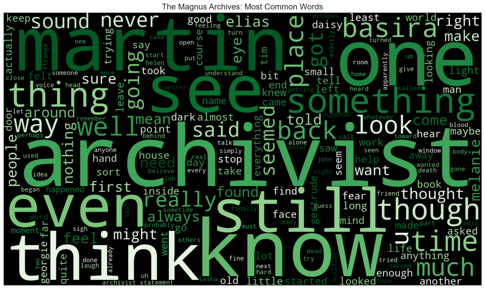
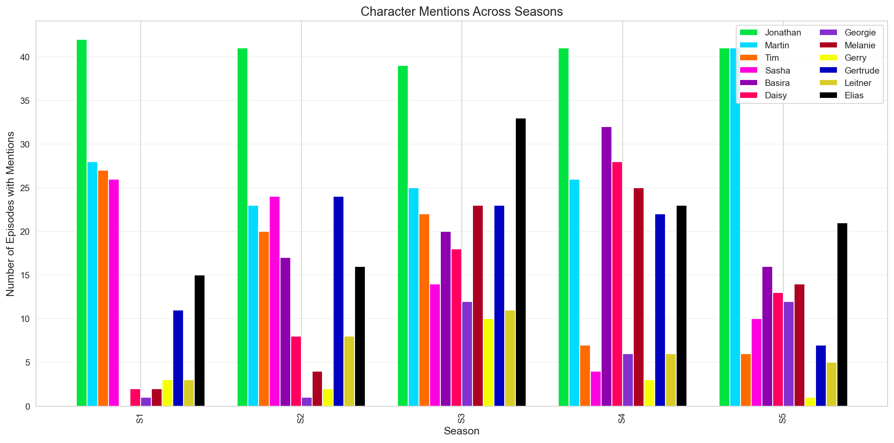
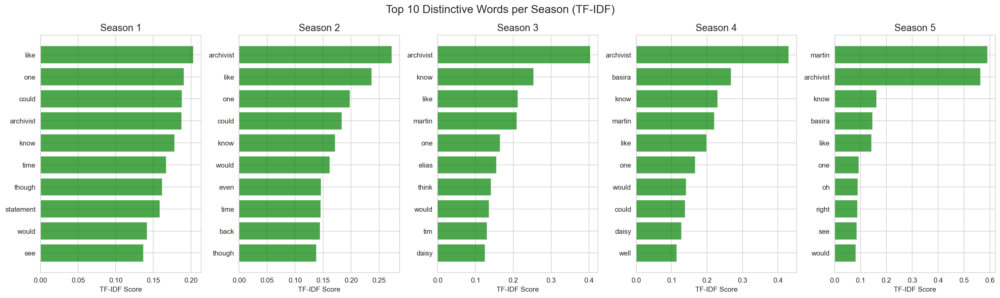
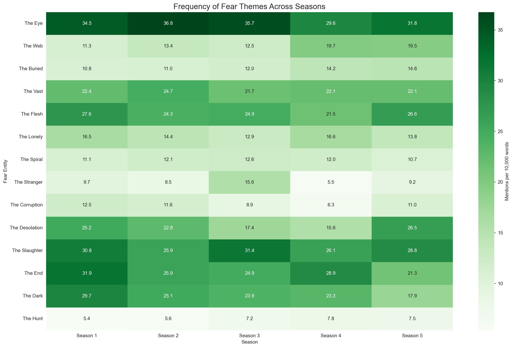
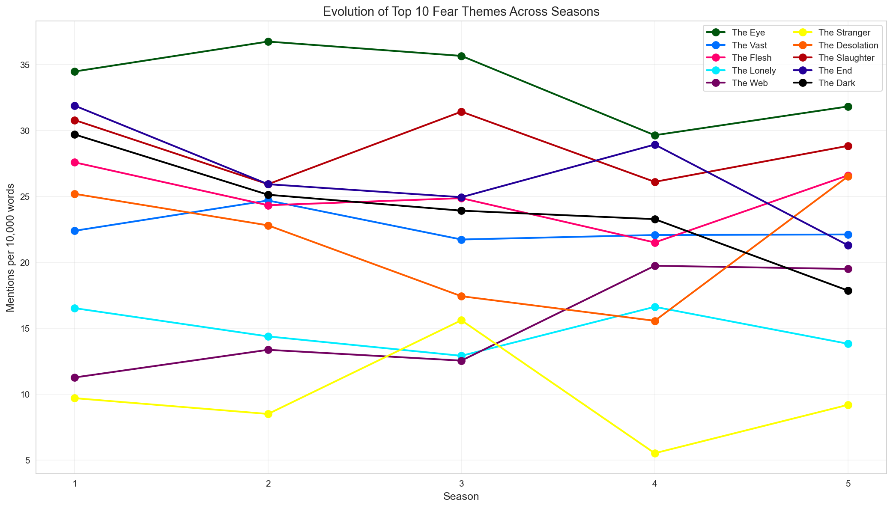
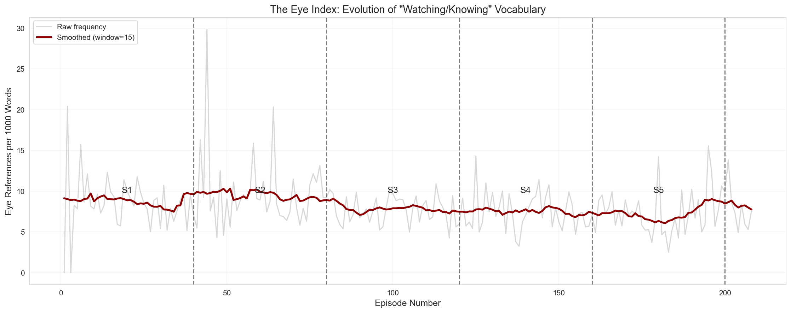

# The Magnus Archives

The Magnus Archives is a weekly horror fiction anthology podcast examining what lurks in the archives of the Magnus Institute, an organisation dedicated to researching the esoteric and the weird. Join new head archivist Jonathan Sims as he attempts to bring a seemingly neglected collection of supernatural statements up to date, converting them to audio and supplementing them with follow-up work from his small but dedicated team.

Individually, they are unsettling. Together they begin to form a picture that is truly horrifying because as they look into the depths of the archives, something starts to look back…

## Make your statement, face your fear.

> There is a wasps’ nest in my attic

The word cloud visualizes the most common words across the entire series.  
- Prominent names (Martin, Archivist, Elias, Daisy) show character centrality.  
- Recurring terms ("fear," "dark," "death") emphasize thematic consistency.  

*[CLICK]*

**The Archive Crew:**

- Jonathan Sims – Head Archivist, central narrator
- Martin Blackwood – Archivist’s assistant, later partner
- Tim Stoker – Archival assistant
- Sasha James – Archival assistant
- Basira Hussain – Police officer, later an archival assistant
- Daisy Tonner – Police officer, Hunter
- Georgie Barker – Jonathan’s ex-girlfriend
- Melanie King – Paranormal investigator, later an archival assistant
- Gerry Keay – Former archival assistant
- Gertrude Robinson – Former Head Archivist
- Leitner – ~~Book collecting dust eating rat~~ Collector of books
- ~~Jonah Magnus~~ Elias Bouchard – Head of the Magnus Institute

This bar chart shows how often key characters are mentioned across the five seasons.  
- The visualization reveals shifts in character prominence and how the story redistributes attention as arcs progress.
- For example, Martin in time becomes as important as Jon
- This chart also shows how character's death (or, in Sasha's case, the reveal of her much more earlier death) changes the number of times their name is mentioned

*[CLICK]*

**The Seasons**

1. Season 1
    - Jon becomes Head Archivist and records supernatural statements, uncovering hints of the Fears.
2. Season 2
    - The team faces conspiracies within the Institute as they are defending it from the worm attacks.  
3. Season 3
    - Rituals and the Entities’ influence grow, while trust among the archive team fades. 
4. Season 4
    - Peter Lukas replaces Elias as the Head of the Institute and every character feels the pull of the Lonely.
5. Season 5
    - The apocalypse begins, London falls under the Fears, and only Jon and Martin can save the day.  

- Again, notable, Martin rises in prominence with time
- Jon is the most special little boy and the most important Anti-Christ

*[CLICK]*

## The Fears

*From the wikia:*

The Entities, also called the Fears, the Powers, the Dread Powers, and The Things That Were Fear are the principle antagonists of The Magnus Archives, and the phenomena that more mundane and earthly antagonists serve.

They are various aspects of an amorphous force of fear that exists next to reality. They are variously also referred to as "Gods", "powers", or simply as "the Fears". Their influence upon reality manifests as supernatural happenings — all supernatural phenomena in the world are simply extensions of them. These phenomena can take various forms such as people, animals, monsters, books, objects, or places, all with the goal of evoking fear, terror, and paranoia from all who encounter them.

These entities do not simply feed off of fear but are fears made manifest. It is not only human fear that counts but that of animals as well, particularly for The Flesh and The Hunt. The more fearful the world is of a certain thing, the more powerful the related entity becomes, becoming empowered by the increased fear of its realm of influence.

| Fear Entity | What It Stands For | Mark Words | Known Avatars |
|-------------|--------------------|------------|---------------|
| The Buried | Fear of confinement, suffocation, being trapped | 'buried', 'earth', 'dirt', 'claustrophobic', 'suffocate', 'crush', 'pressure', 'deep', 'underground', 'grave' | Enrique MacMillian, Hezekiah Wakely |
| The Corruption | Fear of rot, disease, infestation | 'worm', 'wasp', 'corruption', 'rot', 'decay', 'mold', 'infection', 'disease', 'filth', 'contaminate', 'insect', 'maggot' | Jane Prentiss, John Amherst |
| The Dark | Fear of blindness, unseen threats | 'dark', 'darkness', 'shadow', 'lightless', 'blind', 'night', 'black', 'obscure', 'gloom' | People’s Church members, Callum Brodie |
| The Desolation | Fear of fire, pain, senseless destruction | 'desolation', 'fire', 'burn', 'destroy', 'devastation', 'ash', 'flame', 'scorch' | Agnes Montague, Jude Perry |
| The End | Fear of death, inevitability | 'death', 'die', 'mortal', 'final', 'grave', 'coffin', 'terminal', 'mortality', 'expire', 'dead' | Justin Gough, Oliver Banks |
| The Eye | Fear of being watched, exposed | 'record', 'witness', 'observe', 'document', 'truth', 'vision', 'knowing', 'beholding', 'gaze', 'eye','watch' | Jonah Magnus, Jonathan Sims, Gertrude Robinson |
| The Flesh | Fear of meat, bodies, being butchered | 'flesh', 'meat', 'animal', 'bone', 'slaughter', 'butcher', 'body', 'skin', 'muscle', 'carnage', 'blood' | Jared Hopworth, John Haan |
| The Hunt | Fear of being prey, chased | 'hunt', 'hunter', 'prey', 'pursue', 'track', 'fang', 'beast', 'predator', 'chase', 'wild' | Daisy Tonner, Julia Montauk |
| The Lonely | Fear of isolation, abandonment | 'lonely', 'alone', 'abandoned', 'empty', 'forgotten', 'fog', 'mist', 'isolated', 'solitude', 'apart', 'cold' | Peter Lukas, Martin Blackwood |
| The Slaughter | Fear of random violence, war | 'slaughter', 'war', 'violence', 'kill', 'murder', 'massacre', 'carnage', 'combat', 'battle', 'bullet' | Melanie King, The Piper |
| The Spiral | Fear of madness, lies, distortion | 'spiral', 'madness', 'insane', 'crazy', 'distortion', 'mind', 'dream', 'unreliable', 'hallucination', 'fractal' | The Distortion (Michael/Helen) |
| The Stranger | Fear of the uncanny, masks, mannequins | 'stranger', 'unknown', 'unfamiliar', 'mask', 'mannequin', 'circus', 'skin', 'identity', 'uncanny', 'doll' | Nikola Orsinov, Breekon & Hope |
| The Vast | Fear of heights, insignificance, falling | 'vast', 'sky', 'height', 'open', 'ocean', 'space', 'depth', 'fall', 'expanse', 'void', 'infinite' | Mike Crew, Simon Fairchild |
| The Web | Fear of manipulation, control, spiders | 'spider', 'web', 'thread', 'manipulate', 'control', 'plan', 'trap', 'scheme', 'puppet', 'string' | Annabelle Cane, Raymond Fielding |

With The Magnus Institute as a whole being a temple of the Eye, with the Eyepocalypse happening in the finale and with Jon being an avatar of the Eye, the Eye is the most prominent of all the Fears as seen above. 

