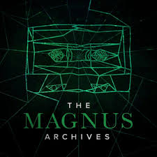

# The Magnus Archives

The Magnus Archives is a weekly horror fiction anthology podcast examining what lurks in the archives of the Magnus Institute, an organisation dedicated to researching the esoteric and the weird. Join new head archivist Jonathan Sims as he attempts to bring a seemingly neglected collection of supernatural statements up to date, converting them to audio and supplementing them with follow-up work from his small but dedicated team.

Individually, they are unsettling. Together they begin to form a picture that is truly horrifying because as they look into the depths of the archives, something starts to look back…

## Make your statement, face your fear.

> There is a wasps’ nest in my attic

**The Archive Crew:**

- Jonathan Sims
  - The Head Archivist
  - The Main Character
- Martin Blackwood
  - Assistant 
  - Was transferred from the Library
- Tim Stocker 
  - Assistant (but better)
  - Loud bisexual
  - Worked with Jon in Research
- Sasha James
  - Assistant (the best)
  - Wanted to be the next Head Archivist
  - Extremely good with computers
- Elias Bouchard
  - Head of the Magnus Institute
    ~~HE'S ALWAYS WATCHING~~

| The Entities | Fears                               | Avatars    |
|--------------|-------------------------------------|------------|
| The Eye      | Being Observed, Forbidden Knowledge | Elias, Jon |
| The Lonely   | Being Lonely, Isolation             | Martin     | 
| The Web      | Being Not In Control, Spiders       | Annabelle  |
| The Stranger | Being Not Quite Right, Imposters    | Nikola     |

**The Seasons**

1. Season 1
    - Introducing to the world and the Crew
2. Season 2
    - Worms are in the Archives, Everything is Normal
3. Season 3
    - Someone isn't who they appear to be
4. Season 4
    - Hello, my name is Peter Lukas
5. Season 5
    - The world has ended